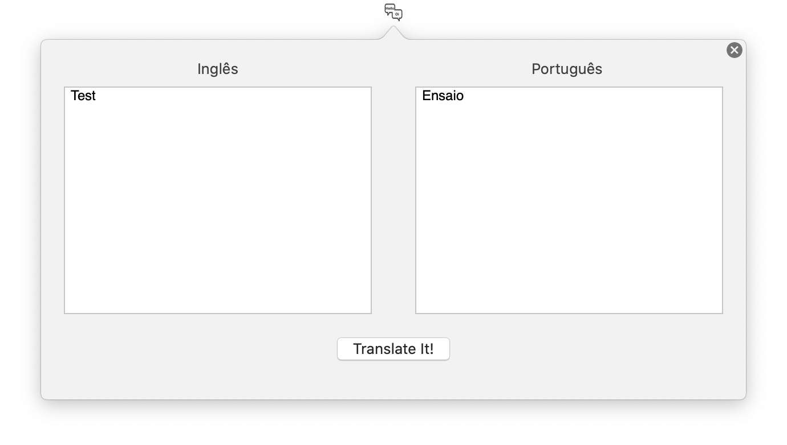

# Translate It!
Personal project to translate from english to portuguese using Swift and IBM Cloud 

The purpose of project is learn the language Swift and create widget useful for everyday

Useful because you don't need open a page or tab in browser to do a translation. With two ViewText you can compare and correct the translation, yes you can edit!

I'm not a professional programmer!

## IBM Cloud ID

You need create an account in IBM Cloud (Lite - Free): https://cloud.ibm.com/login

Create service "Language Translator" proceed with your customization of resource and get ApiKey and URL, edit the file WatsonCredentials.swift and replace the variables with your data  

## TO DO
-Implement switching between the languages

-Spanish, Italian, German and French languages support

-Autodetection

-Shortcuts to automate the process of translation